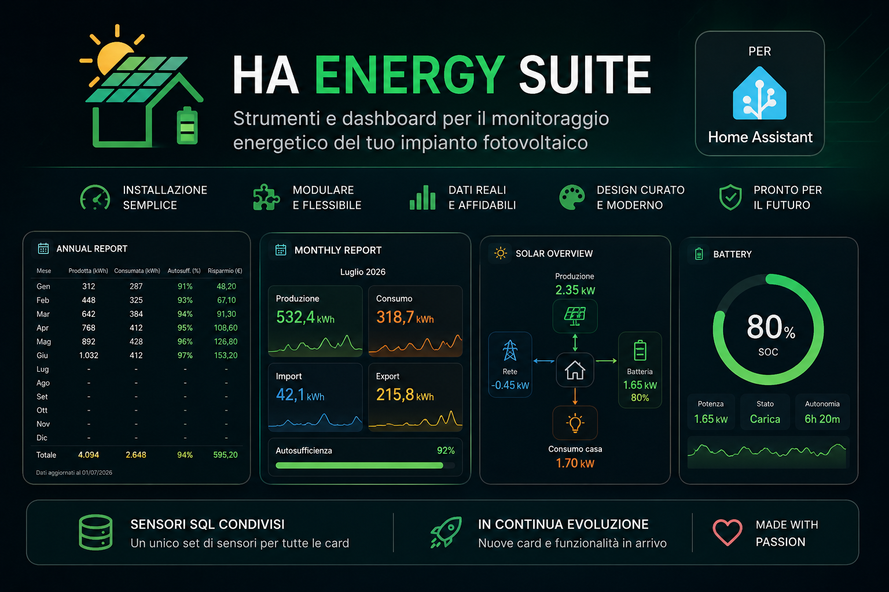

<p align="center">
  
</p>

<p align="center">


</p>

---

# ☀️ HA Energy Suite

**HA Energy Suite** è un progetto Open Source dedicato a **Home Assistant** che raccoglie card, sensori e strumenti per il monitoraggio energetico degli impianti fotovoltaici.

Nasce dall'esperienza maturata sul mio impianto reale con un obiettivo semplice:

> Creare componenti belli, modulari e facili da installare, permettendo di ottenere dashboard professionali in pochi minuti.

---

# ✨ Caratteristiche

- 📊 Card moderne e curate
- ⚡ Sensori SQL condivisi
- 🏠 Basato sulla Dashboard Energia di Home Assistant
- 🔧 Installazione semplice
- 🧩 Architettura modulare
- ❤️ Completamente Open Source

---

# 🚧 Stato del progetto

**Versione attuale**

> **v0.1.0 Alpha**

HA Energy Suite è ancora nelle prime fasi di sviluppo ma è già perfettamente utilizzabile.

Ogni nuova versione introdurrà nuovi moduli mantenendo sempre gli stessi principi:

- Semplicità
- Modularità
- Configurazione minima
- Documentazione completa

---

# 📦 Requisiti

A seconda del modulo scelto potrebbero essere necessari:

- Home Assistant
- Dashboard Energia configurata
- SQL Integration
- custom:button-card

Ogni modulo include un proprio README con le istruzioni complete.

---

# 🚀 Installazione

L'installazione è volutamente semplice.

1. Installa i sensori SQL (una sola volta).
2. Apri la cartella del modulo che desideri installare.
3. Segui il README dedicato.
4. Copia la card nella tua dashboard Lovelace.

Fine.

---

# 📂 Struttura del progetto

```text
HA-Energy-Suite
│
├── .github/
├── assets/
├── cards/
├── docs/
├── screenshots/
├── sql/
│
├── README.md
├── CHANGELOG.md
├── ROADMAP.md
├── CONTRIBUTING.md
├── BRAND.md
└── LICENSE
```

---

# 📦 Moduli

| Modulo | Stato | Descrizione |
|---------|:----:|-------------|
| 📊 Annual Report | ✅ Disponibile | Report annuale con statistiche energetiche mese per mese |
| 📈 Monthly Report | ✅ Disponibile | Analisi completa del mese corrente con produzione, consumi, autosufficienza, costi e risparmio |
| 🔋 Battery Card | 🚧 In sviluppo | Dashboard dedicata al monitoraggio della batteria di accumulo |

Nuovi moduli verranno aggiunti progressivamente mantenendo la stessa filosofia del progetto.

---

# ❤️ Come contribuire

HA Energy Suite è un progetto Open Source sviluppato nel tempo libero.

Puoi contribuire in molti modi:

- ⭐ Lasciando una stella al repository
- 🐞 Segnalando bug
- 💡 Proponendo nuove idee
- 🔧 Inviando una Pull Request
- ❤️ Supportando il progetto tramite GitHub Sponsors

Ogni contributo, piccolo o grande, aiuta il progetto a crescere.

---

# 💡 Filosofia del progetto

HA Energy Suite nasce con un'idea molto semplice.

> **Installa solo ciò che ti serve.**

Ogni componente è completamente indipendente dagli altri.

I sensori SQL rappresentano il motore dati condiviso del progetto, mentre ogni card può essere installata singolarmente in base alle proprie esigenze.

Nessun framework.

Nessuna configurazione complicata.

Solo strumenti modulari costruiti per Home Assistant.

---

# ❤️ Supporta il progetto

HA Energy Suite è sviluppato e mantenuto nel tempo libero.

Se il progetto ti è stato utile e desideri supportarne lo sviluppo, puoi farlo tramite **GitHub Sponsors**.

Il tuo supporto aiuta a dedicare più tempo allo sviluppo di nuove card, al miglioramento della documentazione e al supporto della community.

Anche lasciare una ⭐ al repository è un modo semplice ma importante per contribuire alla crescita del progetto.

Grazie per il tuo supporto! ☀️

---

# 📄 Licenza

Questo progetto è distribuito con licenza **MIT**.