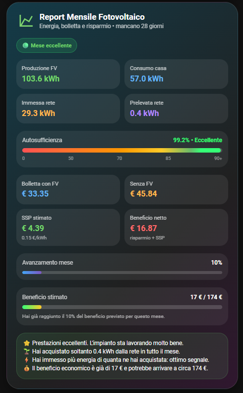

# 📈 Monthly Report

<p align="center">
  
</p>

## Panoramica

**Monthly Report** è una card per Home Assistant che offre una panoramica completa dell'andamento energetico del mese corrente.

In un'unica schermata vengono raccolti i principali indicatori dell'impianto fotovoltaico, permettendo di monitorare produzione, consumi, autosufficienza, costi, risparmio e andamento del mese.

La card utilizza i sensori SQL presenti nella cartella **`/sql`** del repository.

---

# ✨ Funzionalità

La card visualizza:

- ☀️ Produzione fotovoltaica del mese
- 🏠 Consumo dell'abitazione
- ⚡ Energia acquistata dalla rete
- 🔌 Energia immessa in rete
- 📊 Autosufficienza con indicatore grafico
- 💸 Costo stimato della bolletta senza fotovoltaico
- 💰 Costo stimato della bolletta con fotovoltaico
- 💚 Risparmio economico stimato
- 🔵 Ricavo stimato da Scambio sul Posto (SSP)
- 📅 Avanzamento del mese
- 📈 Stima del risultato a fine mese
- 💡 Suggerimenti automatici basati sull'andamento dell'impianto

---

# 📋 Requisiti

Prima dell'installazione assicurati di avere:

- Home Assistant
- Dashboard Energia configurata
- `custom:button-card`
- Sensori SQL installati seguendo la guida presente nella cartella:

```text
/sql/
```

---

# 🚀 Installazione

## 1. Installa i sensori SQL

Prima di utilizzare questa card è necessario installare i sensori SQL.

Apri la cartella:

```text
/sql/
```

e segui il relativo **README.md**.

Questa operazione va eseguita una sola volta.

---

## 2. Riavvia Home Assistant

Dopo aver installato i sensori SQL, riavvia Home Assistant.

---

## 3. Aggiungi la card

Apri la dashboard nella quale desideri inserire la card.

Seleziona:

**Modifica Dashboard → Aggiungi Card → Manuale**

Copia e incolla il contenuto del file:

```text
monthly-report.yaml
```

---

## 4. Personalizza i valori economici

Prima di salvare la card individua queste righe all'inizio del file:

```javascript
const costoKwh = 0.25;
const quotaFissaMese = 18.00;
const sspKwh = 0.15;
const rataMensile = 115.00;
```

Sono gli unici valori che dovrai modificare.

### `const costoKwh = 0.25;`

Inserisci il **costo finale di 1 kWh acquistato**, comprensivo di tutte le componenti della bolletta.

Esempio:

```javascript
const costoKwh = 0.31;
```

---

### `const quotaFissaMese = 18.00;`

Inserisci la **quota fissa media mensile** della bolletta.

Puoi includere anche l'eventuale canone TV.

Esempio:

```javascript
const quotaFissaMese = 22.50;
```

---

### `const sspKwh = 0.15;`

Inserisci il **valore medio riconosciuto per ogni kWh immesso in rete** tramite Scambio sul Posto.

Esempio:

```javascript
const sspKwh = 0.12;
```

---

### `const rataMensile = 115.00;`

Se desideri confrontare il risparmio con il costo del tuo impianto, inserisci la **rata mensile del finanziamento**.

Se il tuo impianto non è finanziato, puoi impostare:

```javascript
const rataMensile = 0;
```

---

Una volta modificati questi valori, salva la card.

Tutti i calcoli economici verranno eseguiti automaticamente utilizzando i valori che hai impostato.

---

# 📝 Note

- Tutti i dati energetici vengono letti dalle Long-Term Statistics della Dashboard Energia.
- I valori economici vengono calcolati utilizzando i parametri configurati all'inizio della card.
- Il beneficio economico tiene conto del risparmio ottenuto grazie al fotovoltaico.
- Il ricavo da Scambio sul Posto (SSP) viene mostrato separatamente.
- I dati dipendono dai sensori SQL installati nella cartella `/sql`.

---

# ❤️ Supporto

Hai trovato un bug o desideri proporre un miglioramento?

Puoi:

- Aprire una **GitHub Issue**
- Inviare una **Pull Request**

Se questa card ti è stata utile, lascia una ⭐ al repository.

Ogni contributo aiuta il progetto a crescere.

---

# 📄 Licenza

Distribuito con licenza **MIT**.